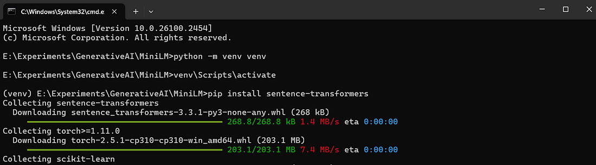
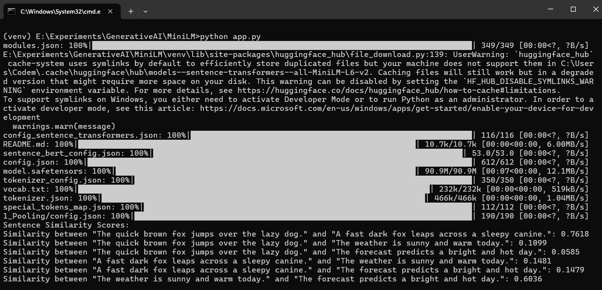
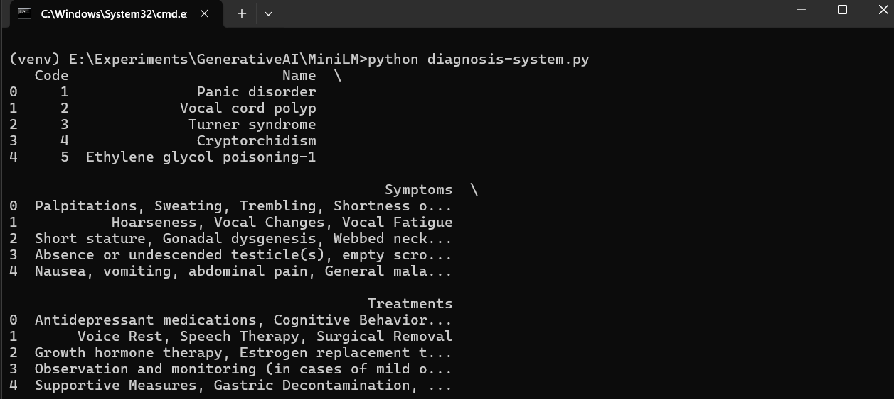
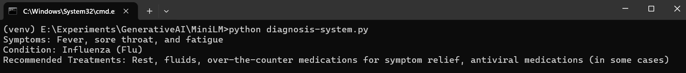

# Diagnosis system using MiniLM

all-MiniLM-L6-v2 is a specialized version of MiniLM, fine-tuned for sentence embeddings. It is part of the Sentence Transformers library and is widely used for generating high-quality sentence embeddings in tasks requiring semantic textual similarity.

### Installation

```
pip install -U sentence-transformers
```

### Usage

```py
from sentence_transformers import SentenceTransformer

# 1. Load a pretrained Sentence Transformer model
model = SentenceTransformer("all-MiniLM-L6-v2")

# The sentences to encode
sentences = [
    "The weather is lovely today.",
    "It's so sunny outside!",
    "He drove to the stadium.",
]

# 2. Calculate embeddings by calling model.encode()
embeddings = model.encode(sentences)
print(embeddings.shape)
# [3, 384]

# 3. Calculate the embedding similarities
similarities = model.similarity(embeddings, embeddings)
print(similarities)
# tensor([[1.0000, 0.6660, 0.1046],
#         [0.6660, 1.0000, 0.1411],
#         [0.1046, 0.1411, 1.0000]])
```

### Screenshots





